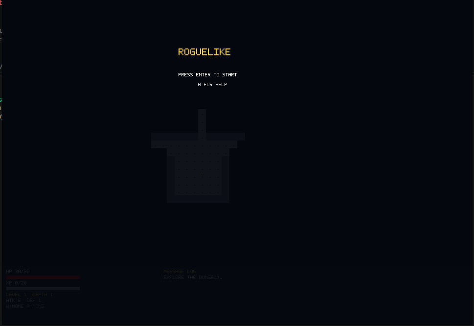
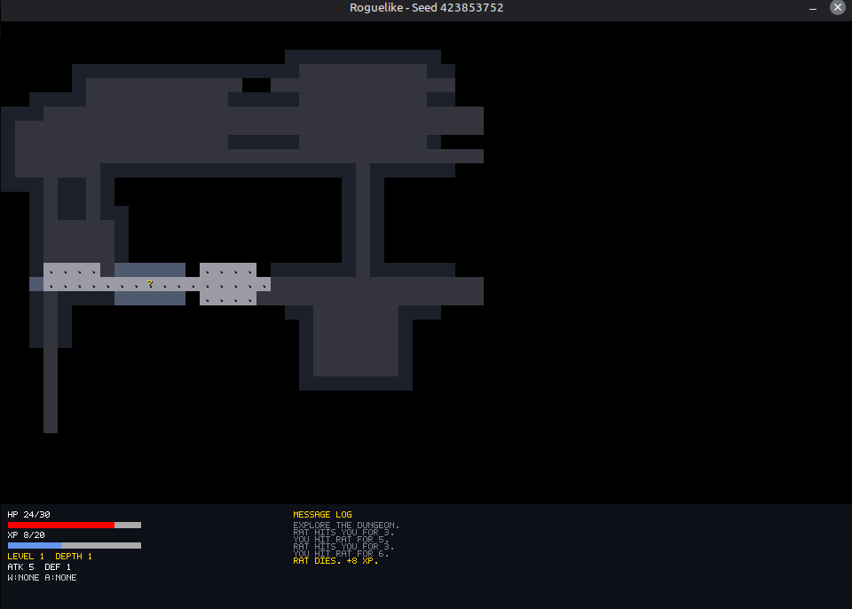

# Roguelike

Roguelike is a 2D turn-based roguelike written in C# with MonoGame and .NET 8. It generates a dungeon procedurally, advances one turn per movement or action, uses permadeath for completed runs, loads gameplay content from JSON, and draws text with an embedded bitmap font.

## Screenshots



Title screen with main menu (Continue, New Run, New Run With Seed, Run History, Help, Quit).



Playing session with fog of war, a scroll, combat feedback, and the HUD.

## Status

This project is a work in progress.

Implemented in code:

- Procedural dungeon generation with seeded, deterministic random streams.
- Turn-based movement, waiting, combat, monsters, stairs, loot, inventory, equipment, consumables, XP, and level progression.
- Fog of war and an in-game message log.
- JSON-driven monsters, items, and balance values.
- File saves, atomic save backups, resume loading, death cleanup, and run history.
- Title menu with Continue (if save exists), New Run, New Run With Seed, Run History, Help, and Quit.
- Seed Entry screen: accept digits 0-9, max 9 digits, empty input or Enter to start, Backspace to delete, Esc to return to title.
- Run History screen: top 10 runs ranked by depth, then level, then turns; scroll with Up/Down.
- Pause menu with Resume, Save and Quit, Abandon Run (with confirmation), Help, and Quit to Title.
- Game Over screen with rank position, seed, and run stats.
- Examine mode: X to enter, arrows/WASD/numpad to move cursor over visible tiles, Esc to exit; shows terrain/monster/item descriptions without consuming turns.
- Automated unit and integration coverage in `Roguelike.Tests`.

## Requirements

- .NET 8 SDK
- A desktop operating system supported by MonoGame DesktopGL: Windows, macOS, or Linux. This repository was verified in a Linux environment; other platforms are not hand-tested here.

## Build and run

```bash
dotnet restore
dotnet build -warnaserror
dotnet run
dotnet run -- --seed 12345
```

`dotnet run` chooses a random seed. The same seed produces the same first level. The `--seed` option accepts an invariant-culture integer.

## Controls

| Action | Keys | Screen |
| --- | --- | --- |
| Move | Arrow keys, WASD, or numpad 8/2/4/6 | Playing |
| Wait one turn | Space | Playing |
| Examine mode | X | Playing |
| Move examine cursor | Arrow keys, WASD, or numpad 8/2/4/6 | Examine |
| Exit examine | Esc | Examine |
| Open/close inventory | I; Esc also closes it | Playing/inventory |
| Move inventory selection | Up/Down or W/S | Inventory |
| Use or equip selected item | Enter | Inventory |
| Drop selected item | D | Inventory |
| Unequip weapon/armor | 1/2 | Inventory |
| Pause | Esc | Playing |
| Resume or close a screen | Esc | Paused/help/examine |
| Restart | R, then Y to confirm or N/Esc to cancel | Playing; Game Over/Paused restarts directly |
| Navigate title menu | Up/Down or W/S | Title |
| Select title menu item | Enter | Title |
| Open help | H | Title or Paused |
| Close help | Enter or Esc | Help |
| Navigate paused menu | Up/Down or W/S, then Enter | Paused |
| Quit from the title | Esc | Title |
| Return to the title | Esc | Game Over |
| Seed Entry: enter seed digit | 0-9 or numpad 0-9 | Seed Entry |
| Seed Entry: delete last digit | Backspace | Seed Entry |
| Seed Entry: start (random if empty) | Enter | Seed Entry |
| Seed Entry: return to title | Esc | Seed Entry |
| Run History: scroll | Up/Down or W/S | Run History |
| Run History: return to title | Esc | Run History |

The Help screen also prints the movement, wait, inventory, item, and glyph controls. The renderer displays the currently supported glyphs: `@` player, `r/g/a/B/s` monsters, `!` potions, `?` scrolls, `/` weapons, `[` armor, and `>` stairs.

## Gameplay quick guide

- Find the stairs `>` and descend to the next level.
- `@` is the player. Monsters use their configured letters; items use their configured type glyphs.
- Moving, waiting, using an item, equipping, dropping, or descending advances the turn as implemented by the game state.
- Defeating monsters grants XP. Reaching the XP threshold raises the level and applies the configured level bonuses.
- A run is permadeath: death changes the run to Game Over, deletes its save, and records the run.
- The default save directory is the application-data directory followed by `Roguelike`.
- Use the title menu to continue a saved run, start a new run with a random or specified seed, browse run history, or quit.

## Saves and history

By default, the game writes:

```text
<application-data>/Roguelike/save.json
<application-data>/Roguelike/save.json.bak
<application-data>/Roguelike/history.json
```

`--save-dir <dir>` changes `<application-data>/Roguelike` to the directory supplied. The game autosaves when descending stairs, and Save and Quit is available in the pause menu. Death deletes both the primary save and its backup. If `save.json` is corrupt or fails validation, the game tries `save.json.bak` and reports `Loaded backup save from save.json.bak.` when that succeeds.

## Content and modding

The default `Content/` JSON files are embedded in the executable. To make a variant, copy the directory, edit one or more values, and pass the copy:

```bash
cp -r Content Content-local
```

For example, changing the rat's XP in `Content-local/monsters.json`:

```json
{ "id": "rat", "name": "Rat", "glyph": "r", "color": "#D3D3D3", "maxHp": 6, "attack": 3, "defense": 0, "xp": 10, "sightRadius": 6, "minDepth": 1, "spawnWeight": 30, "behavior": "chase", "params": { "alwaysChase": 1, "alertTurns": 5 } }
```

Run with the custom directory:

```bash
dotnet run -- --content Content-local
```

The directory must contain `monsters.json`, `items.json`, and `balance.json` with schema version 2 and valid references. Invalid content stops the game, writes every validation error to stderr, and exits with code 1.

## Tests

```bash
dotnet test
```

Run the tests to verify content loading, combat, items, persistence, run lifecycle, examine mode, menus, and fuzz invariants.

## Project layout

```text
Content/          Embedded default monsters, items, and balance JSON.
Persistence/      Versioned save encoding, loading, and file storage.
Runs/             Completed-run history and ranking.
Text/             Bitmap font and text layout.
UI/               Input mapping and screen state.
Roguelike.Tests/  Automated xUnit tests.
docs/             Architecture notes and screenshots.
```

## Architecture

See [docs/ARCHITECTURE.md](docs/ARCHITECTURE.md). Game logic is headless and deterministic; the renderer only draws.

## Known limitations

- No sound system is present.
- No full manual playthrough record is included; the automated tests are the available verification.
- Only Linux was hand-verified in this environment.

## License

No license has been chosen yet.
